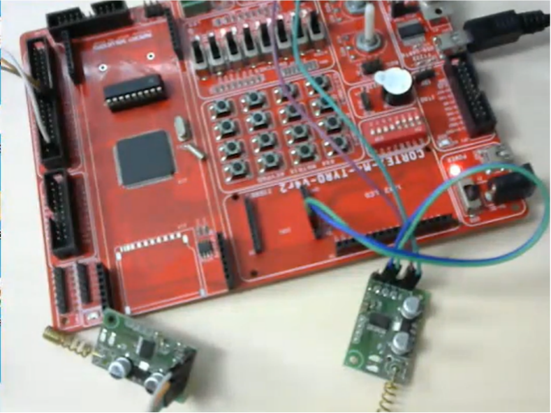
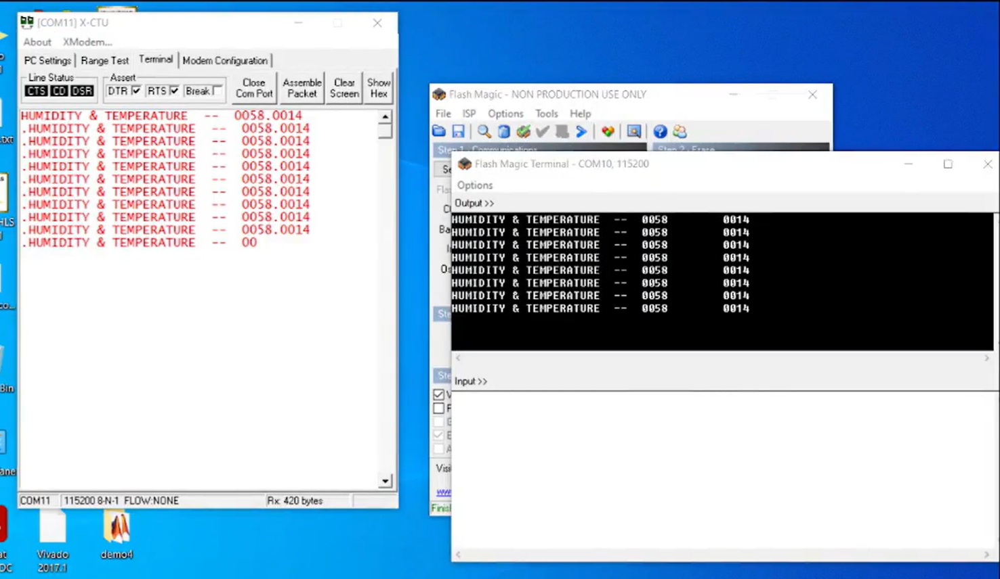

# IoT Temperature Monitoring System using LoRa

## Author

Om Bidikar

---

## About the Project

This project implements a wireless temperature and humidity monitoring system using an ARM Cortex-M4 LPC4088 microcontroller, DHT11 sensor, and LoRa module.

The system collects environmental data and transmits it wirelessly over long distances using LoRa communication to a receiver connected to a PC.

---

## Features

* Real-time temperature and humidity monitoring
* Long-range wireless communication (2–5 km line of sight)
* Low power communication using LoRa
* UART-based data transmission
* Configurable transmission interval
* ASCII formatted output for easy readability

---

## 📁 Project Structure

IoT-Temperature-Monitor-LoRa-ARM-Cortex-M4/

* src/ → dht11.c
* startup/ → LPC startup file
* docs/ → setup guide, circuit diagram
* assets/ → images (hardware & output)
* README.md

---

## 🔌 Hardware Setup

### Transmitter (Sensor Node)

* ARM Cortex-M4 LPC4088 Development Board
* LoRa Module (SX1278/SX1276)
* DHT11 Temperature & Humidity Sensor

### Receiver (Base Station)

* LoRa Module
* FT232 USB-to-Serial Converter
* PC (Terminal Interface)

---

## 🔗 Pin Connections

### DHT11 → LPC4088

```
Data → P4.0
VCC  → 5V
GND  → GND
```

### LoRa → LPC4088

```
TX → P0.3 (UART RX)
RX → P0.2 (UART TX)
VCC → 3.3V
GND → GND
```

---

## ⚙️ Software Requirements

* Keil µVision IDE
* Flash Magic
* PuTTY / HyperTerminal

---

## ▶️ How to Run

1. Open project in Keil µVision
2. Build the project
3. Flash code using Flash Magic
4. Connect LoRa receiver to PC
5. Open serial terminal (115200 baud)

---

## 📸 Output

### Hardware Setup



### Serial Output



---

## 🧪 Sample Output

```
HUMIDITY & TEMPERATURE  --  0058    0014
```

---

## 🧠 How It Works

1. DHT11 sensor reads temperature & humidity
2. Data is processed and converted to ASCII format
3. UART transmits data to LoRa module
4. LoRa sends data wirelessly
5. Receiver displays data on PC via FT232

---

## 🧠 Concepts Used

* ARM Cortex-M4 Embedded Programming
* UART Communication
* LoRa Wireless Protocol
* Sensor Interfacing (DHT11)
* Embedded C Programming

---

## ⚠️ Limitations

* No encryption implemented
* Single node communication
* Basic data formatting

---

## 🚀 Future Improvements

* Multi-node sensor network
* Power optimization
* Data logging system
* Web-based monitoring dashboard
* Secure communication (encryption)

---

## 📘 License

This project is for learning purposes.
